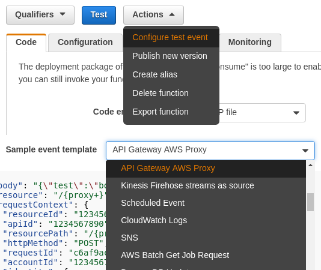

<a id="top" name="top"></a>
[][aws-home]
[][eawsy-home]

# eawsy/aws-lambda-go-net

> Amazon API Gateway proxy for AWS Lambda Go runtime.

[![Api][badge-api]][eawsy-api]
[![Status][badge-status]](#top)
[![License][badge-license]](LICENSE)
[![Help][badge-help]][eawsy-chat]
[![Social][badge-social]][eawsy-twitter]

[AWS Lambda][aws-lambda-home] lets you run code without provisioning or managing servers. With 
[eawsy/aws-lambda-go-shim][eawsy-runtime], you can author your Lambda function code in Go. This project provides a 
seamless proxy layer which translates [Amazon API Gateway][aws-apigateway-home] requests to [Go HTTP][misc-go-pkg-http] 
requests. It allows you for example to **port your existing Go HTTP applications** to Amazon API Gateway & AWS Lambda, 
**without modification**.

[](#top)
## Quick Hands-On

> For step by step instructions on how to author your AWS Lambda function code in Go, see 
  [eawsy/aws-lambda-go-shim][eawsy-runtime].
  Vanilla Go `net/http` package is used for the sake of simplicity. You are free to use your favorite Go Web framework.

[](#top)
### Dependencies

```sh
go get -u -d github.com/eawsy/aws-lambda-go-net/...
```

[](#top)
### Create

```go
package main

import (
	"net/http"

	"github.com/eawsy/aws-lambda-go-net/service/lambda/runtime/net"
	"github.com/eawsy/aws-lambda-go-net/service/lambda/runtime/net/apigatewayproxy"
)

// Handle is the exported handler called by AWS Lambda.
var Handle apigatewayproxy.Handler

func init() {
	ln := net.Listen()

	// Amazon API Gateway binary media types are supported out of the box.
	// If you don't send or receive binary data, you can safely set it to nil.
	Handle = apigatewayproxy.New(ln, []string{"image/png"}).Handle

	// Any Go framework complying with the Go http.Handler interface can be used.
	// This includes, but is not limited to, Vanilla Go, Gin, Echo, Gorrila, Goa, etc.
	go http.Serve(ln, http.HandlerFunc(handle))
}

func handle(w http.ResponseWriter, r *http.Request) {
	w.Write([]byte("Hello, World!"))
}
```

[](#top)
### Build

> For step by step instructions on how to author your AWS Lambda function code in Go, see 
  [eawsy/aws-lambda-go-shim][eawsy-runtime].

```sh
make
```

[](#top)
### Deploy

> [AWS Serverless Application Model][aws-sam-github] (SAM) is used for the sake of simplicity. You are free to use your 
  favorite deployment tool.

```yaml
AWSTemplateFormatVersion: '2010-09-09'
Transform: AWS::Serverless-2016-10-31
Resources:
  Function:
    Type: AWS::Serverless::Function
    Properties:
      Handler: handler.Handle
      Runtime: python2.7
      CodeUri: ./handler.zip
      Events:
        ApiRoot:
          Type: Api
          Properties:
            Path: /
            Method: ANY
        ApiGreedy:
          Type: Api
          Properties:
            Path: /{proxy+}
            Method: ANY
Outputs:
  URL:
    Value: !Sub "https://${ServerlessRestApi}.execute-api.${AWS::Region}.amazonaws.com/Prod"
```

```sh
aws cloudformation package \
  --template-file example.sam.yaml \
  --output-template-file example.out.yaml \
  --s3-bucket <YOUR BUCKET NAME>

aws cloudformation deploy \
  --template-file example.out.yaml \
  --capabilities CAPABILITY_IAM \
  --stack-name <YOUR STACK NAME>
```

[](#top)
### Invoke

```sh
aws cloudformation describe-stacks \
  --stack-name <YOUR STACK NAME> \
  --query Stacks[0].Outputs[0]

# "https://<YOUR API URL>/"

curl https://<YOUR API URL>/

# Hello, World!
```

> If you want to execute your AWS Lambda function from the AWS Lambda console, please pay attention to the 
  provided test event. This project is intended to run seamlessly behind an **Amazon API Gateway Proxy**.

  <p align="center">
    
  </p>


[](#top)
## About

[][eawsy-home]

This project is maintained and funded by Alsanium, SAS.

[We][eawsy-home] :heart: [AWS][aws-home] and open source software. See [our other projects][eawsy-github], or 
[hire us][eawsy-hire] to help you build modern applications on AWS.

[](#top)
## Contact

We want to make it easy for you, users and contributers, to talk with us and connect with each others, to share ideas, 
solve problems and make help this project awesome. Here are the main channels we're running currently and we'd love to 
hear from you on them.

### Twitter 
  
[eawsyhq][eawsy-twitter] 

Follow and chat with us on Twitter. 

Share stories!

### Gitter 

[eawsy/bavardage][eawsy-chat]

This is for all of you. Users, developers and curious. You can find help, links, questions and answers from all the 
community including the core team.

Ask questions!

### GitHub

[pull requests][eawsy-pr] & [issues][eawsy-issues]

You are invited to contribute new features, fixes, or updates, large or small; we are always thrilled to receive pull 
requests, and do our best to process them as fast as we can.

Before you start to code, we recommend discussing your plans through the [eawsy/bavardage channel][eawsy-chat], 
especially for more ambitious contributions. This gives other contributors a chance to point you in the right direction, 
give you feedback on your design, and help you find out if someone else is working on the same thing.

Write code!

[](#top)
## License

This product is licensed to you under the Apache License, Version 2.0 (the "License"); you may not use this product 
except in compliance with the License. See [LICENSE](LICENSE) and [NOTICE](NOTICE) for more information.

[](#top)
## Trademark

Alsanium, eawsy, the "Created by eawsy" logo, and the "eawsy" logo are trademarks of Alsanium, SAS. or its affiliates in 
France and/or other countries.

Amazon Web Services, the "Powered by Amazon Web Services" logo, and AWS Lambda are trademarks of Amazon.com, Inc. or its 
affiliates in the United States and/or other countries.


[eawsy-home]: https://eawsy.com
[eawsy-github]: https://github.com/eawsy
[eawsy-runtime]: https://github.com/eawsy/aws-lambda-go-shim
[eawsy-chat]: https://gitter.im/eawsy/bavardage
[eawsy-twitter]: https://twitter.com/@eawsyhq
[eawsy-api]: https://godoc.org/github.com/eawsy/aws-lambda-go-net
[eawsy-hire]: https://docs.google.com/forms/d/e/1FAIpQLSfPvn1Dgp95DXfvr3ClPHCNF5abi4D1grveT5btVyBHUk0nXw/viewform
[eawsy-pr]: https://github.com/eawsy/aws-lambda-go-net/issues?q=is:pr%20is:open
[eawsy-issues]: https://github.com/eawsy/aws-lambda-go-net/issues?q=is:issue%20is:open

[aws-home]: https://aws.amazon.com/
[aws-lambda-home]: https://aws.amazon.com/lambda/
[aws-apigateway-home]: https://aws.amazon.com/api-gateway/
[aws-sam-github]: https://github.com/awslabs/serverless-application-model

[misc-go-pkg-http]: https://golang.org/pkg/net/http

[badge-api]: http://img.shields.io/badge/api-godoc-3F51B5.svg?style=flat-square
[badge-status]: http://img.shields.io/badge/status-beta-009688.svg?style=flat-square
[badge-license]: http://img.shields.io/badge/license-apache-FF5722.svg?style=flat-square
[badge-help]: http://img.shields.io/badge/help-gitter-E91E63.svg?style=flat-square
[badge-social]: http://img.shields.io/badge/social-twitter-03A9F4.svg?style=flat-square
